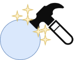

<!-- Improved compatibility of back to top link: See: https://github.com/lolakkalol/6502-computer-project/pull/73 -->

<!--
*** Thanks for checking out the Best-README-Template. If you have a suggestion
*** that would make this better, please fork the repo and create a pull request
*** or simply open an issue with the tag "enhancement".
*** Don't forget to give the project a star!
*** Thanks again! Now go create something AMAZING! :D
-->

<!-- PROJECT SHIELDS -->
<!--
*** I'm using markdown "reference style" links for readability.
*** Reference links are enclosed in brackets [ ] instead of parentheses ( ).
*** See the bottom of this document for the declaration of the reference variables
*** for contributors-url, forks-url, etc. This is an optional, concise syntax you may use.
*** https://www.markdownguide.org/basic-syntax/#reference-style-links
-->
[![Contributors][contributors-shield]][contributors-url]
[![Forks][forks-shield]][forks-url]
[![Stargazers][stars-shield]][stars-url]
[![Issues][issues-shield]][issues-url]
<!--[![MIT License][license-shield]][license-url]
[![LinkedIn][linkedin-shield]][linkedin-url]-->

<!-- PROJECT LOGO -->
 

  

  <h3 align="center">A Papyrus impact and variability plugin</h3>

  

    A meta-model and tool for impact analysis of SysML models!
     
    <a href="https://github.com/lolakkalol/Papyrus-Impact-Plugin"><strong>Explore the docs »</strong></a>
     
     
    <a href="https://github.com/lolakkalol/Papyrus-Impact-Plugin/tree/main/examples">View Example Projects</a>
    ·
    <a href="https://github.com/lolakkalol/Papyrus-Impact-Plugin/issues">Report Bug</a>
    ·
    <a href="https://github.com/lolakkalol/Papyrus-Impact-Plugin/issues">Request Feature</a>
  

<!-- TABLE OF CONTENTS -->

  
Table of Contents

  <ol>
    <li>
      <a href="#about-the-project">About The Project</a>
      <ul>
        <li><a href="#built-with">Built With</a></li>
      </ul>
    </li>
    <li>
      <a href="#getting-started">Getting Started</a>
      <ul>
        <li><a href="#prerequisites">Prerequisites</a></li>
        <li><a href="#installation">Installation</a></li>
      </ul>
    </li>
    <li><a href="#usage">Usage</a></li>
    <li><a href="#roadmap">Roadmap</a></li>
    <li><a href="#contributing">Contributing</a></li>
    <li><a href="#license">License</a></li>
    <li><a href="#contact">Contact</a></li>
    <li><a href="#acknowledgments">Acknowledgments</a></li>
  </ol>

<!-- ABOUT THE PROJECT -->
## About The Project

[![Product Name Screen Shot][product-screenshot]](https://example.com)
This plugin implements a UML2 meta-model to create variable product composition diagrams using the SysML block definition diagrams.
The plugin also implements a new view called the "Impact tool," which uses the information provided by the meta-model to check constraints, goals, requirements, and more.
To use the impact tool, one must follow the rules to ensure that the assumption it makes still holds. While this is made with the use of papyrus in mind, it should work with any model created using UML2, as the plugin only relies on UML2 APIs but has not been tested.

For more information on how the meta-model, tool, and method can be used to perform impact analysis, see: [Link to thesis (Not uploaded yet)](http://example.com/)

(<a href="#readme-top">back to top</a>)

### Installation and building
This plugin was built using the downloadable [Eclipse Papyrus RCP 2023-12 release (6.6.0)](https://eclipse.dev/papyrus/download.html).

#### Build from repository
To build the plugin JAR follow these steps:
1. Clone the repository
2. Import repository into workspace
   - In Eclipse, select `File -> Import`
   - Select `Existing Projects into Workspace` and press `Next`
   - Select the repository folder as the root directory and press `Finish`
   - The repository should now be in your workspace
3. Export project as JAR
   - Right click the imported project in the project explorer
   - Click `Export`
   - Under `Plug-in Development` select `Deployable plug-ins and fragments` and press `Next`
   - Leave default selection, choose the destination directory, and press `Finish`. The destination can be the plugin folder of the Eclipse application where you want to install it.
4. Finished! The JAR file should now be located at the specified destination directory

#### Install from compiled JAR
To install the plugin in your Eclipse installation, simply copy the JAR file to your Eclipse's plugins folder and restart.
Make sure that Ecore, UML2, and Papyrus APIs are installed.

(<a href="#readme-top">back to top</a>)

<!-- GETTING STARTED -->
## Getting Started
This repository can be used in two ways, either as is to model a product variability composition and performing impact analysis using the built in tool, or used as an API to interact with the models.

To get started on modelling, see the `Usage` and `Installation and building` sections.

The repository is structured as follows:
`icons` contains the icons used by the plugin.
`model` contains both the meta-model profile (`com.alexander.thesis.profile.uml`) and its genmodel and ecore model. Both the genmodel and ecore model are created from the profile.
`src/ImpactProfile` contains the code generated by the genmodel.
`src/com/alexander/thesis/tool` contains the impact API's source code and the impact view's implementation. All methods documented.

### Modify the meta-model/profile
The `model/com.alexander.thesis.profile.di` file contains the papyrus model used to edit the meta-model. To modify the meta-model, open the papyrus model and use the diagram editor provided by papyrus to make the required changes. 
As the profile is included as a static UML2 profile multiple plugin extensions need to be defined, these are already made and does not need to be updated but for the sake of documentation are mentioned here:

- `org.eclipse.emf.ecore.generated_package`
- `org.eclipse.uml2.uml.generated_package`
- `org.eclipse.papyrus.uml.extensionpoints.UMLProfile` (Is only needed for papyrus to find the profile)

To update the profile in the plugin follow these steps:

  
Update details

1. Save the profile.

2. Open `model/com.alexander.thesis.profile.genmodel` (with EMF Generator).

3. Right click the top level item `Com.alexander.thesis` in the opened editor and press `Reload...`.
 

4. Select `UML model` in the pop-up window and press `Next`.

5. You can safely ignore the warning and just press `OK`.
 

6. Leave the default options, model URI, and press `Next`. (Make sure that the model URI is pointing to the profile model `model/com.alexander.thesis.profile.uml`).

7. Leave default again and press `Finish`

8. Now we need to re-generate the code, if you encounter problems here try and delete all `src/ImpactProfile*` files, these are the autogenerated files we will create now.

9. While still in the genmodel editor opened in step 2, right click the top level item and press `Generate Model Code`.

10. The plugin should now be updated to include the updated profile.

### Modify the impact API
If you so wish to change or add to the impact API simply edit the files under `src/com/alexander/thesis/tool` and reexport the JAR file to create a standalone plugin, or create a launch configuration to launch a new instance of eclipse with the plugin.

### Modify the impact view
As the view is simply composed of SWT components which call the impact APIs simply change `src/com/alexander/thesis/tool/View.java` and reexport the JAR file to create a standalone plugin, or create a launch configuration to launch a new instance of eclipse with the plugin.

See [Link to thesis](http://example.com/) to understand how to use the plugin.

<!-- USAGE EXAMPLES -->
## Meta-Model

This section will introduce the created meta-model and how it functions.
The meta-model was created to capture necessary product meta-data but does not aim at modelling its logical structure per RFLP. It is focused on creating a model that can describe the hierarchical composition of the product together with its system context. It does this to reason about different choices by utilising a variability concept together with constraints, goals, and requirements. Variability modelling was chosen due to its ability to capture different system configurations in the same model. It can hence capture different decisions or choices that engineers can take, which allows for reasoning about said choices in the same centralised model both by humans and machines.

The meta-model consists of three main constructs: variability points, choices, and goals, each with its own properties and semantics. As the Eclipse Papyrus SysML 1.6 implementation includes a requirement stereotype, this was not included in the thesis meta-model but is still utilised.

### Variability point
The variability point is arguably the most essential stereotype of the meta-model. The variability point is used on a SysML block to signify that this system has different possible alterations, and a choice needs to be made to create a complete system. Multiple choices can be attached to the variability point through a generalisation relationship, as seen in Figure 13b, signifying that the variability point is a generalisation of the actual physical implementation. Looking at it using RFLP, the variability point can be seen as the logical component of the system and the choices as the physical implementation of said logical components. In Figure 13b the CPU can then be seen as the logical implementation independent component, and a generalisation of its choices which are specialisations of the variability point. This show a specific physical implementation of the logical system.
The variability point stereotype only has two different properties: domain and mutual exclusion. The domain property is used to mark what engineering domain it belongs to, and it currently has three different selectable domains: electronics, mechanical, and software. These domains were seen as the significant domains for a generic product. These domains will only serve as a visual mark for the engineer creating the variability model and others interested in specific domains. The mutual exclusion property is a true or false property and marks the number of choices that can be made; if the property is true, one choice will exclude all other choices; if false, a selection does not exclude all other choices attached to a variability point, and hence multiple choices are possible.

### Choice
As mentioned each variability point is a generalisation of different choices that can be made, and to capture this choice a `Choice` stereotype to capture relevant meta-data for decision making was created. This stereotype contains the following properties: `Performance`, `PerformanceType`, `Power`, `Costs` at different quantities, `Selected`, and `Multiplicity`.
The `Performance` property is a floating point number representing the `Choice`'s performance and can be seen as a type of KPI. What performance represents is dictated by the `PerformanceType` property, which currently can be one of the following: `MIPS`, `MHz`, `KB`, `MB`, `GB`, `DMIPS`, `Efficiency`, `Dissipation`, and `Not Applicable (NA)`. Each of these different `PerformanceType`s are meant to represent different systems' performances as different systems can have differing types of performance metrics, for example a power supplies performance might be measured in its efficiency while it might be `MIPS` or `MHz` for a computer processing system. Some of the common `KPI`s are however added as a separate property since system selection often does not depend on a single factor, these common ones are explained next.
The `Power` property specifies the power consumption or production of the choice. If the power property is positive it is consuming power and if it is negative it produces. This way power satisfaction can easily be checked by looking at one property. The `Costs` property specifies the cost of the choice at different quantities, i.e., a CPU, when purchased one by one, might cost 100 cost units, while bulk buying 100 CPUs, instead cost 96 cost units per CPU. This is can be captured in the `Costs` property by specifying the cost of one unit for a specific quantity. This can be done for however many quantities one finds useful. The last property of the choice stereotype is its property selected, which can either be true or false and shows whether this choice has been selected and included in the solution. The `Multiplicity` property specifies the quantity of systems the choice encompasses. The `Multiplicity` property is used to signify that there will be multiples of the choice, this will be used by the impact tool later on to determine the total cost and power of the system.

### Goal
The `Goal` stereotype, see Figure 15a, is then used to set goals for either an entire system, i.e. a system that contains multiple different variability points, or for a single variability point. An example of this is the previous example of a RGC where one might put a goal on the general compute architecture that its cost should be no more than 1000 cost units, see Figure 15c. It is also possible to budget the individual choices, i.e. put a goal on the `CPU` variability point of the general compute architecture that it should be no more than 100 cost units, see Figure 15b. These goals in the meta-model contain three different properties: `Goal`, `GoalType`, and `GoalCheck`. The `Goal` property is a floating point number expressing a quantity which will be used to check the goal's satisfaction, i.e. 100 for the above CPU example. The `GoalType` property specifies what the `Goal` property number represents, and it has the same type as the choice's `Type` property with the addition of the `Costs` type. This property then specifies what the goal is setting a goal on, either the `Performance` or the `Costs` property of the target. The third property, `GoalCheck`, determines when the goal is satisfied and has five different possible selections: `GT`, `GTE`, `LT`, `LTE` and, `EQ`. Using the CPU example, in Figure 15b, `Goal1` is then satisfied when the selected `Choice` of the `CPU` variability point is less than or equal to 100.0 cost units. When the goals are set on systems instead of variability points however, the sum of the selected choices cost or power property, of all variability points included in said system, would have to satisfy the goal. Additionally if a goal is set on multiple systems or variability points, only one of the targets needs to satisfy the goal to mark the goal as satisfied. This was done to allow multiple different systems to possibly satisfy the same goal and is intended to be used when multiple sub-systems can satisfy a goal but all of them does not need to.

### Constraints
To add to the `Goal` stereotype, constraints which limit the allowed selection of choices were also added. The constraints added was `Includes` and `Excludes` relationships between choices, see Figure 16. These constraints are created as stereotypes which are added onto `Dependency` relationships between choices, both signifying that the two choices depend on each other but further signifying that another constrains the choice, see Figure 16a. The `Includes` constraint forces the selection of the constrained choice if the constrainer is selected; see Figure 16b. The same as for the includes constraint can be said for the `Excludes` constraint but here the constrained choice shall not be selected if the constraining choice is selected, see Figure 16c. These constraints further limits the possible choice space 

See [Link to thesis](http://example.com/)

(<a href="#readme-top">back to top</a>)

## Method and Process
This section will introduce some modelling rules, the modelling method and a modelling example.
To allow for a consistency in the model, enough for the impact tool to be able to make assumptions, traverse the model, and process it, a set of rules regarding, construction, constraints, parameters, and goals and requirements are set out here. As these rules are only just that rules, a generic approach to create a model sufficient for one's needs are also presented and proposed through an example.

### Modellig rules

#### Construction rules
These are the general construction rules required to follow while constructing the variability model.

1. A variability point is a SysML block with the stereotype `VariabilityPoint`.

2. A choice is a SysML block with the stereotype `Choice`.

3. The product to be modeled shall be, together with other systems subject to the impact tool, contained inside a block named `System Context`.

4. The `System Context` block shall be placed in a package or model element which is at the next to highest level of the package directory, with the stereotype `VariabilityModel`, see Figure 19.

5. Composition of the product and `System Context` shall be specified using `Composite association` relationships.

6. Decomposition of choices will be ignored by the impact tooling; decomposition of variability points are allowed, however, choices should be decomposed instead if one wants more detail as these are ignored by the tool while variability points are not and can cause unwanted behaviour. 

7. Choices are associated to a variability point through a `Generalization` relationship from the choice to the variability point, see Figure 13b.

#### Goals and requirements rules
These are the rules needed to be followed while adding requirements and goals to the variability model.

1. A requirement is a SysML pre-defined `Requirement` modelling element.

2. A goal is a SysML block with the stereotype `Goal`.

3. All requirements which are to be checked by the tooling shall be in a folder called `Requirements` at the same package level as the variability model, see Figure \ref{fig:requiredPackageStructure}.

4. Goal's targets are associated to either a system containing variability points OR directly to a variability point through a `Directed association` from the goal to the target, see Figure 15b and 15c.

5. A SysML requirement is associated to a target goal through the SysML relationship `Verify` from the requirement to the target goal which satisfy the requirement.

6. A SysML requirement can be associated to multiple target goals.

7. Goals can only target one system or variability point.

#### Constraints rules

  
1. A constraint is a `Dependency` relationship with the stereotype `Includes` or `Excludes`.

2. Constraints shall only be placed between choices.

3. A constraint consists of a constraining choice and a constrained choice, where the constraint relationship goes from the constraining choice to the constrained choice, see Figure \ref{fig:IncludesConstraint} and \ref{fig:ExcludesConstraint}.

#### Parameter rules
These are the parameter rules that modelling elements with the `Choice` stereotype must adhere to.

  
1. The `PerformanceType` property specifies what is in the `Performance` property
   - Efficiency: Specifies the power efficiency of the system in decimal form, i.e. 80\% -> 0.8. This is used during power calculations.
   - Dissipation: Used to specify how much heat the system is able to dissipate
   - NA: Specifies that the Performance field is Not Applicable (NA)
   - The rest is only used for specification.

3. The `Power` property specifies the power consumption/production of a choice.
   - Power > 0: Consuming power
   - Power < 0: Producing power
   - Power = 0: Passive/Neither

4. The `Costs` property specifies the cost of a choice for different quantities.
   - The set of quantity for each choice should be the same, as the tool simply sums the cost of each quantity when calculating cost.
   - Quantity = 0: Apply cost to all quantities
   - Quantity > 0: Cost is specific to the quantity
   - Quantity < 0: Undefined behavior

5. The Selected property determines if the impact tool should deem the choice as selected for analysis.
6. Only ONE choice between all choices connected to the same variability point should be selected if `MutualExclusion` is true.

(<a href="#readme-top">back to top</a>)

<!-- CONTACT -->
## Contact

Alexander Stenlund -  alexander.stenlund@telia.com

Project Link: [https://github.com/lolakkalol/Papyrus-Impact-Plugin](https://github.com/lolakkalol/Papyrus-Impact-Plugin)

(<a href="#readme-top">back to top</a>)

<!-- ACKNOWLEDGMENTS -->
## Acknowledgments

How to add a UML2 profile to a plugin as a static profile:
[http://nyssen.blogspot.com/2009/09/defining-static-profiles-with-eclipse.html](http://nyssen.blogspot.com/2009/09/defining-static-profiles-with-eclipse.html)

(<a href="#readme-top">back to top</a>)

<!-- MARKDOWN LINKS & IMAGES -->
<!-- https://www.markdownguide.org/basic-syntax/#reference-style-links -->
[contributors-shield]: https://img.shields.io/github/contributors/lolakkalol/Papyrus-Impact-Plugin.svg?style=for-the-badge
[contributors-url]: https://github.com/lolakkalol/Papyrus-Impact-Plugin/graphs/contributors
[forks-shield]: https://img.shields.io/github/forks/lolakkalol/Papyrus-Impact-Plugin.svg?style=for-the-badge
[forks-url]: https://github.com/lolakkalol/Papyrus-Impact-Plugin/network/members
[stars-shield]: https://img.shields.io/github/stars/lolakkalol/Papyrus-Impact-Plugin.svg?style=for-the-badge
[stars-url]: https://github.com/lolakkalol/6502-computer-project/stargazers
[issues-shield]: https://img.shields.io/github/issues/lolakkalol/Papyrus-Impact-Plugin.svg?style=for-the-badge
[issues-url]: https://github.com/lolakkalol/Papyrus-Impact-Plugin/issues
[license-shield]: https://img.shields.io/github/license/lolakkalol/Papyrus-Impact-Plugin.svg?style=for-the-badge
[license-url]: https://github.com/lolakkalol/Papyrus-Impact-Plugin/blob/master/LICENSE.txt
<!--[linkedin-shield]: https://img.shields.io/badge/-LinkedIn-black.svg?style=for-the-badge&logo=linkedin&colorB=555
[linkedin-url]: https://linkedin.com/in/ -->
[product-screenshot]: images/screenshot.png
